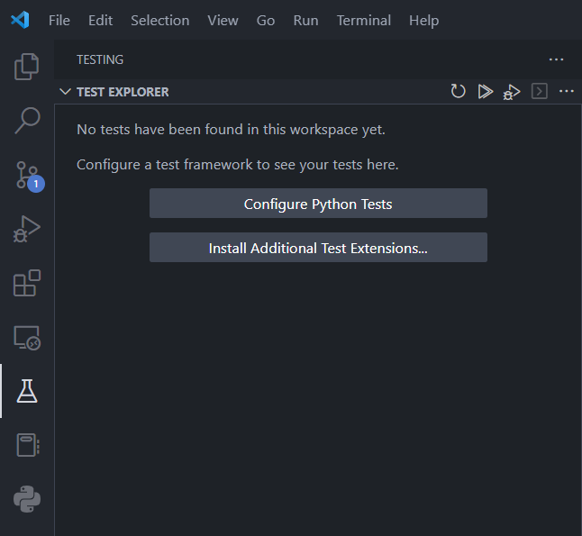

# Python Project Template(With Pytest)

## Introduction

When using VS Code to run some python scripts, or pytest scripts, some pitfalls occurred.
This repo intends to:
1. Offer a **python project template** with pytest
2. Offer the config .json files for .vscode, like `launch.json`, `settings.json` and `tasks.json`
3. Point out some **pitfalls** that may occur during the development

## Project Structure
```bash  
root
│  .gitignore
│  README.md
│
├─.vscode
│      launch.json
│      settings.json
│      tasks.json
│
├─src
│      __init__.py
│
└─tests
       __init__.py
```

1. **.vscode**
This directory contains all the configuration files(.json) that work for VS Code
2. **src**
This directory contains all the functions, class and algorithm you implement
3. **tests**
This directory contains all the test scripts you write

## Pitfalls  
1. **launch.json**
```json
{
    "version": "0.2.0",
    "configurations": [
        {
            "name": "Python: Current File",
            "type": "python",
            "request": "launch",
            "program": "${file}",
            "console": "internalConsole",
            "justMyCode": true,
            "cwd": "${workspaceFolder}",  
            "env": {
                "PYTHONPATH": "${workspaceFolder}"
            }
        }
    ]
}
```
The `env` key containing `PYTHONPATH` is of great importance, without this, you will fail when importing some modules you implememt on your own.
Let's say we implement a class called `Subject` in `src/subject.py`, and import this class in some other directory, like `code/run.py`(This involves python **absolute imports** from **the top-level package folder**).
```Python
# src/subject.py
class Subject:
    def __init__(self):
        print('subject')    


code/run.py
from src.subject import Subject  
```
This code won't fail in PyCharm, for PyCharm automatically adds the root directory path of the project to you `PYTHONPATH`, which you can print those via this code:  
```Python
import sys
for path in sys.path:
    print(path)
```
The reason that this fails in VS Code is VS Code doesn't automatically add variables to `PYTHONPATH`, so either you add it in your python scripts, or you configure it in VS Code `launch.json`(**recommended!**)  

2. **settings.json**
```json
{
    "python.testing.pytestArgs": [
        "."
    ],
    "python.testing.unittestEnabled": false,
    "python.testing.pytestEnabled": true,
    "python.testing.cwd": "${workspaceFolder}", 
}
```
`python.testing.cwd` sets the directory for vscode to detect test scripts which start with `test`, like `test_subject.py`. However, you can ignore this, for VS Code supports configuring python tests by clicking `Configure Python Tests` button in `Testing` part on the left side of the VS Code.  



3. **tests/\_\_init\_\_.py**  
```Python
import sys
sys.path.append("../")
```
`"../"` actually means the root directory path of your project.  
Adding the root directory path of your project will solve the failure when importing modules from src directory. In this way, you can import modules from the root path like:
```Python
# test/test_subject.py
from src.subject import Subject
```  
Without this, if you run `pytest` in the terminal, it may fail when importing modules.  

## Tips
1. Always use absolute import in Python unless the path is complex and would make the statement too long

## Reference
1. [Python absolute and relative imports](https://realpython.com/absolute-vs-relative-python-imports/)


